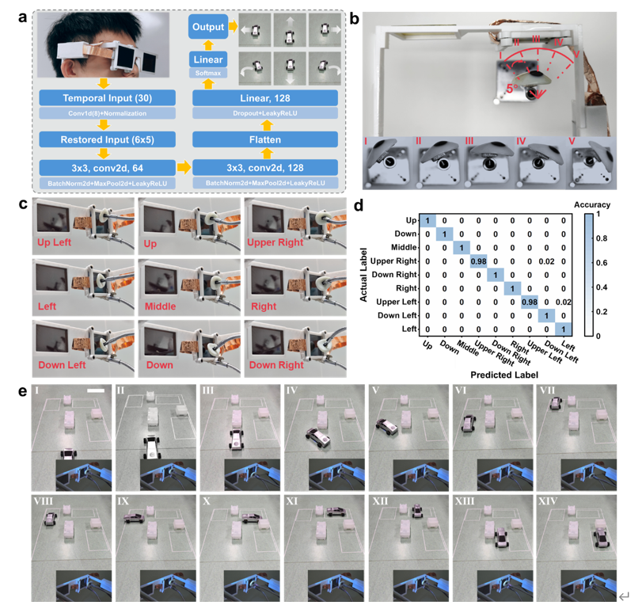

# Perovskite-based Smart Eyeglasses as Noncontact Human-Computer Interaction

More than 70% of human information comes from vision. The eye is one of mostattractive sensing sites to collect biological parameters. 
However, it is urgent to developa cost-effective and easy-to-use approach to monitor the eyeball information in aminimal invasive way instead of current smart contact lenses or camera-basedeyeglasses. 
Here, the biomimetic mineralization strategy is developed to prepare large-grained perovskite film on the glass with prepared ITO electrodes, 
which displays theon-offratio close to 300 times at 500 Lux light intensity, 
and the responsiveness reaches 22.09 A/W.The smart eyeglasses composed of perovskite-based photodetectors candirectly covert the visual stimuli from the reflective light of eyeballs into electricalsignals in all light circumstances. 
After scaling up the pretraining data and the modelsize, the smart eyeglasses achieve the noncontact monitoring the eyeball movementwith the recognition angle of 5°, which can be used to unobtrusively drive the modelcar with great freedom. 
The smart eyeglasses based on the perovskite photodetectorsprovide cost-effective approaches for monitoring eyeball movements, which will showgreat potential in the applications of man-machine control, 
augmented reality,individual healthcare, etc.

## Solutions

https://raw.githubusercontent.com/Ming1112-66/Smart-Glasses/main/demo.mp4
